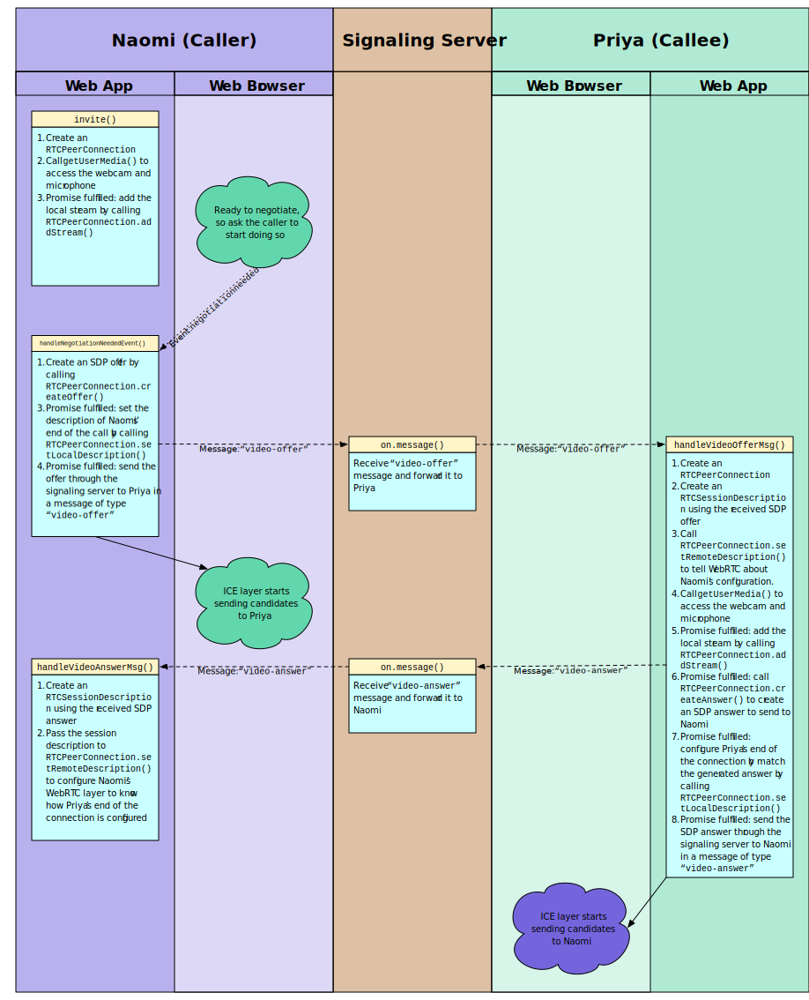
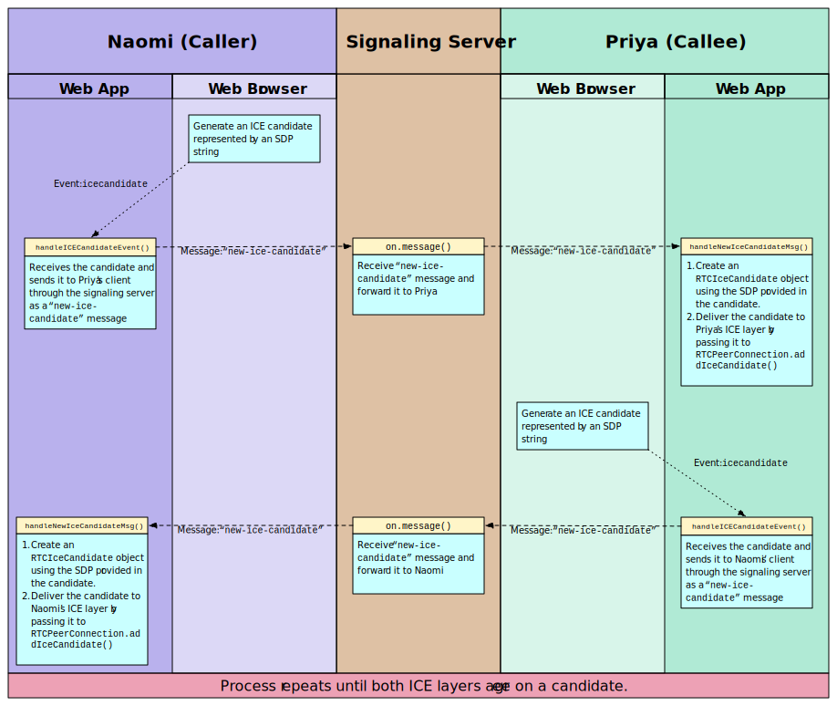

# What is WebRTC

> WebRTC (Web Real-Time Communication) is a technology which enables Web applications and sites to capture and optionally stream audio and/or video media, as well as to exchange arbitrary data between browsers without requiring an intermediary. [referenced from MDN](https://developer.mozilla.org/en-US/docs/Web/API/WebRTC_API)

WebRTC consists of 2 parts:
1. Media capture and streams. related APIs are [`navigator.mediaDevices.getUserMedia`](https://developer.mozilla.org/en-US/docs/Web/API/MediaDevices/getUserMedia) etc.;
2. Peer connection, which empower clients to communicate without requiring an intermediary. related primary interface is [`RTCPeerConnection`](https://developer.mozilla.org/en-US/docs/Web/API/RTCPeerConnection).

---

# How does WebRTC work

Media capture and streams is fundamental and straightforward, here's the [API doc](https://developer.mozilla.org/en-US/docs/Web/API/MediaDevices);

What may raise our interest is how to deliver the captured media stream from one client to another.

A common approach we come up with is to set up a set of APIs, to enable clients push & pull media. The disadvantage of this approach is that every byte of media user captured must go through our server, which is a significant bandwith cost. And besides, media are captured as streams instead of fragments, which requires real time communication. So we either reduce polling interval or use web socket to exchange media data.

To conquer the above disadvantages, WebRTC introduces P2P communication as it's data exchange method.

## How to set up a peer-to-peer connection

### Basic steps for ICE

1. The caller captures local Media via `navigator.mediaDevices.getUserMedia()`
2. The caller creates `RTCPeerConnection` and called `RTCPeerConnection.addTrack()`
3. The caller calls `RTCPeerConnection.createOffer()` to create an offer.
4. The caller calls `RTCPeerConnection.setLocalDescription()` to set that offer as the local description (that is, the description of the local end of the connection).
5. After `setLocalDescription()`, the caller asks STUN servers to generate the ice candidates
6. The caller uses the signaling server to transmit the offer to the /intended receiver of the call.
7. The recipient receives the offer and calls `RTCPeerConnection.setRemoteDescription()` to record it as the remote description (the description of the other end of the connection).
8. The recipient does any setup it needs to do for its end of the call: capture its local media, and attach each media tracks into the peer connection via `RTCPeerConnection.addTrack()`
9. The recipient then creates an answer by calling `RTCPeerConnection.createAnswer()`.
10. The recipient calls `RTCPeerConnection.setLocalDescription()`, passing in the created answer, to set the answer as its local description. The recipient now knows the configuration of both ends of the connection.
11. The recipient uses the signaling server to send the answer to the caller.
12. The caller receives the answer.
13. The caller calls `RTCPeerConnection.setRemoteDescription()` to set the answer as the remote description for its end of the call. It now knows the configuration of both peers. Media begins to flow as configured.

After above step 5, clients start to exchange ICE candidates.

---

The diagrams seems clear but with 2 critical concepts missing:
1. What is ICE?
2. What is signaling server?

## What is ICE

>Interactive Connectivity Establishment (ICE) is a framework to allow your web browser to connect with peers. ICE uses STUN and/or TURN servers to accomplish this, as described below.

### What is STUN and TURN [reference to MDN explanation](https://developer.mozilla.org/en-US/docs/Web/API/WebRTC_API/Protocols)

>#### STUN
>Session Traversal Utilities for NAT (STUN) is a protocol to discover your public address and determine any restrictions in your router that would prevent a direct connection with a peer.
>The client will send a request to a STUN server on the Internet who will reply with the client’s public address and whether or not the client is accessible behind the router’s NAT.

>#### TURN
>Some routers using NAT employ a restriction called ‘Symmetric NAT’. This means the router will only accept connections from peers you’ve previously connected to.
>Traversal Using Relays around NAT (TURN) is meant to bypass the Symmetric NAT restriction by opening a connection with a TURN server and relaying all information through that server. You would create a connection with a TURN server and tell all peers to send packets to the server which will then be forwarded to you. This obviously comes with some overhead so it is only used if there are no other alternatives.

---

Basically, STUN and TURN are protocols we use to penetrate NAT and allow clients to communicate directly with each other.

It is to be concerned that TURN actually is a fallback when NAT stricts STUN protocol. TURN plays a role like a bi-direction proxy, which cost huge amount of bandwidth. And it may be better to use a centralized topology instead of P2P topology when we are forced to use TURN.

There are several free STUN servers, some are provided by Google. but TURN servers, as they are quite costy, are to be purchased.

## What is signaling server

> WebRTC allows real-time, peer-to-peer, media exchange between two devices. A connection is established through a discovery and negotiation process called _**signaling**_.

The WebRTC protocols and frames are almost complete, once ICE finished, clients may exchange arbitrary data directly (TURN server works transparently) with each other, the APIs provided by browsers are resilient and easy to understand. But the one piece missing can be critical, how do we do ICE?

I mean, for a client, what STUN and TURN return are the method to access it self, while we don't know anything about the other clients yet before ICE, and there are no means to give STUN returns to the other clients.

WebRTC has no defination or specification for signal service implementations.

### Serverless implementation [reference to repo](https://github.com/cjb/serverless-webrtc)

Three essential elements ICE needs are *offer*, *answer* and *ICE candidates*. As long as we can pass the infomation of a client to another, the ICE can be done with WebRTC APIs.

Inspired by it's very essential requirements, the most straight way is to copy and paste the info. Which is what this repository demonstrates.

---

To develop a business oriented product, the above approach doesn't seem sufficient, we need a set of services to exchange *offer*, *answer* and *ICE candidates* for clients.

here are some great summaries from blog wrote by Sam Dutton, a WebRTC develop from Google.

>### Peer discovery [reference to source](https://www.html5rocks.com/en/tutorials/webrtc/infrastructure/)
>This is a fancy way of saying — how do I find someone to talk to?
>For telephone calls we have telephone numbers and directories. For online video chat and messaging, we need identity and presence management systems, and a means for users to initiate sessions. WebRTC apps need a way for clients to signal to each other that they want to start or join a call.
>Peer discovery mechanisms are not defined by WebRTC and we won't go into the options here. The process can be as simple as emailing or messaging a URL: for video chat applications such as talky.io, tawk.com and browsermeeting.com you invite people to a call by sharing a custom link. Developer Chris Ball has built an intriguing serverless-webrtc experiment that enables WebRTC call participants to exchange metadata by any messaging service they like, such as IM, email or homing pigeon.

>### How can I build a signaling service [reference to source](https://www.html5rocks.com/en/tutorials/webrtc/infrastructure/)
>To reiterate: signaling protocols and mechanisms are not defined by WebRTC standards. Whatever you choose, you'll need an intermediary server to exchange signaling messages and application data between clients. Sadly, a web app cannot simply shout into the internet 'Connect me to my friend!'
>Thankfully signaling messages are small, and mostly exchanged at the start of a call. In testing with appr.tc (domain suspended) we found that, for a video chat session, a total of around 30–45 messages were handled by the signaling service, with a total size for all messages of around 10kB.
>As well as being relatively undemanding in terms of bandwidth, WebRTC signaling services don't consume much processing or memory, since they only need to relay messages and retain a small amount of session state data (such as which clients are connected).

In the demo I wrote, I used RESTful APIs and polling to accomplish this task of connecting and exchange ICE info. But I strongly advice not to expose the service as RESTful APIs.

As a signal service, it needs to hold a session and clients within the session. And it needs to hold clients' states of info exchanging. Unfortunately HTTP protocols are stateless, to achieve above goals we need to wrap it with some complex logics. And if the states are corrupted, it'd be a mass and hard to recover. Web socket seems a better approach of exposing the service.

In the service, to coordinate sessions, some mechinisms may also be required.

>### Scaling signaling [reference to source](https://www.html5rocks.com/en/tutorials/webrtc/infrastructure/)
>Although a signaling service consumes relatively little bandwidth and CPU per client, signaling servers for a popular application may have to handle a lot of messages, from different locations, with high levels of concurrency. WebRTC apps that get a lot of traffic need signaling servers able to handle considerable load.
>We won't go into detail here, but there are a number of options for high volume, high performance messaging, including the following:
>* eXtensible Messaging and Presence Protocol (XMPP), originally known as Jabber: a protocol developed for instant messaging that can be used for signaling. Server implementations include ejabberd and Openfire. JavaScript clients such as Strophe.js use BOSH to emulate bidirectional streaming, but for various reasons BOSH may not be as efficient as WebSocket, and for the same reasons may not scale well. (On a tangent: Jingle is an XMPP extension to enable voice and video; the WebRTC project uses network and transport components from the libjingle library, a C++ implementation of Jingle.)
>* Open source libraries such as ZeroMQ (as used by TokBox for their Rumour service) and OpenMQ. NullMQ applies ZeroMQ concepts to web platforms, using the STOMP protocol over WebSocket.
>* Commercial cloud messaging platforms that use WebSocket (though they may fall back to long polling) such as Pusher, Kaazing and PubNub. (PubNub also has an API for WebRTC.)
>* Commercial WebRTC platforms such as vLine.

# REFERENCES
* [MDN WebRTC API](https://developer.mozilla.org/en-US/docs/Web/API/WebRTC_API)
* [WebRTC in the real world: STUN, TURN and signaling By Sam Dutton](https://www.html5rocks.com/en/tutorials/webrtc/infrastructure/)
* [WebRTC official site](https://webrtc.org/)
* [WebRTC github.io samples](https://webrtc.github.io/samples/)
