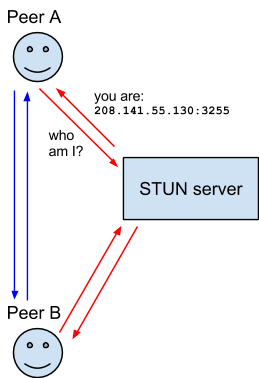

# What is WebRTC

> WebRTC (Web Real-Time Communication) is a technology which enables Web applications and sites to capture and optionally stream audio and/or video media, as well as to exchange arbitrary data between browsers without requiring an intermediary. [referenced from MDN](https://developer.mozilla.org/en-US/docs/Web/API/WebRTC_API)

WebRTC consists of 2 parts:
1. Media capture and streams. related APIs are [`navigator.mediaDevices.getUserMedia`](https://developer.mozilla.org/en-US/docs/Web/API/MediaDevices/getUserMedia) etc.;
2. Peer connection, which empower clients to communicate without requiring an intermediary. related primary interface is [`RTCPeerConnection`](https://developer.mozilla.org/en-US/docs/Web/API/RTCPeerConnection).

---

# How does WebRTC work

Media capture and streams is fundamental and straightforward, here's the [API doc](https://developer.mozilla.org/en-US/docs/Web/API/MediaDevices);

What may raise our interest is how to deliver the captured media stream from one client to another.

A common approach we come up with is to set up a set of APIs, to enable clients push & pull media. The disadvantage of this approach is that every byte of media user captured must go through our server, which is a significant bandwith cost. And besides, media are captured as streams instead of fragments, which requires real time communication. So we either reduce polling interval or use web socket to exchange media data.

To conquer the above disadvantages, WebRTC introduces P2P communication as it's data exchange method.

## How to set up a peer-to-peer connection

---

The diagrams seems clear but with 2 critical concepts missing:
1. What is ICE?
2. What is signaling server?

## What is ICE

>Interactive Connectivity Establishment (ICE) is a framework to allow your web browser to connect with peers. ICE uses STUN and/or TURN servers to accomplish this, as described below.

### What is STUN and TURN [referenced from MDN](https://developer.mozilla.org/en-US/docs/Web/API/WebRTC_API/Protocols)

#### STUN

>Session Traversal Utilities for NAT (STUN) is a protocol to discover your public address and determine any restrictions in your router that would prevent a direct connection with a peer.

>The client will send a request to a STUN server on the Internet who will reply with the client’s public address and whether or not the client is accessible behind the router’s NAT.

#### TURN

>Some routers using NAT employ a restriction called ‘Symmetric NAT’. This means the router will only accept connections from peers you’ve previously connected to.

>Traversal Using Relays around NAT (TURN) is meant to bypass the Symmetric NAT restriction by opening a connection with a TURN server and relaying all information through that server. You would create a connection with a TURN server and tell all peers to send packets to the server which will then be forwarded to you. This obviously comes with some overhead so it is only used if there are no other alternatives.

---

Basically, STUN and TURN are protocols we use to penetrate NAT and allow clients to communicate directly with each other.

It is to be concerned that TURN actually is a fallback when NAT stricts STUN protocol. TURN plays a role like a bi-direction proxy, which cost huge amount of bandwidth. And it may be better to use a centralized topology instead of P2P topology when we are forced to use TURN.

There are several free STUN servers, some are provided by Google. but TURN servers, as they are quite costy, are to be purchased.

## What is signaling server

> WebRTC allows real-time, peer-to-peer, media exchange between two devices. A connection is established through a discovery and negotiation process called _**signaling**_.
